# Proje Yapısı

Projemizde kullanacağımız yapıya dair ayrıntılı dökümantasyonu aşağıda bulabilirsiniz. Projemizi baştan sona katmanlı mimariye uygun olarak ve belli kurallar çerçevesinde kodlayacağız.

Bir projeyi hayata geçirirken birden fazla yöntem vardır ve bu yöntemlerin birçoğunun kullanılmasının uygun olduğu söylenebilir. Ancak, kullanılan yöntemler her ne kadar doğru olsa da ekip çalışması yürütülen bir projede birbirinden farklı yöntemler kullanılması bir süre sonra projenin yapısının karmaşık bir hal almasına sebet olabilmektedir. Bu yüzden, projelerimizde önceden belirlenmiş yöntemler ve teknolojilerin kullanılması (MVVM, Provider, vs.) ve aynı yapıda kod yazılması hedeflenmektedir. Bu dökümanın amacı da yazılacak kodlara dair belirli ve **mutlaka uyulması beklenen** kurallar tanımlamaktır.

İçindekiler:

* [Klasör Yapısı](#klasör-yapısı)
* [MVVM Katmanları](#mvvm-katmanları)
  * [Model](#model)
  * [View](#view)
  * [ViewModel](#viewmodel)
* [State Management (Provider)](#state-management-provider)
  * [ChangeNotifierProvider](#changenotifierprovider)
  * [Provider.of](#providerof)
  * [Consumer](#consumer)
* [Veri Katmanları](#veri-katmanları)
  * [Base](#base)
  * [Service - Base](#service---base)
  * [Service](#service)
  * [Repository](#repository)
  * [GetIt (locator)](#getit-locator)

## Klasör Yapısı

Projelerimizdeki klasör (paket) yapısı aşağıdaki gibi olacaktır.

<!--
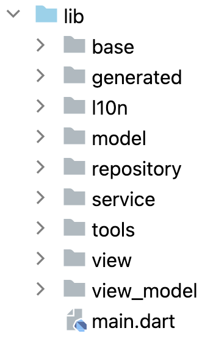
-->


Bu klasörlerin bir kısmı, projemizdeki **katmanlı mimari** yapısının **katman**larını temsil etmektedir. Bu katmanlara tek tek değineceğiz.

> ***ÖN BİLGİ:*** Aşağıdaki grafik, her bir katmanın diğer katmanlardan hangisine ulaşabileceğini göstermektedir. Örneğin, *View* katmanı sadece *ViewModel* katmanına ulaşabiliyor, *ViewModel* katmanı sadece *Repository* katmanına ulaşabiliyor vb. Diğer yönden bakarsak, *ViewModel* katmanına sadece *View* katmanı ulaşabiliyor, *View* katmanına ise hiçbir katman ulaşamıyor. *Model* katmanı ise hiçbir katmana ulaşamıyor ama tüm katmanlar *Model* katmanına ulaşabiliyor. Tüm bu ilişkilerle ilgili ayrıntıyı dökümanın ilerleyen kısımlarında bulabilirsiniz.

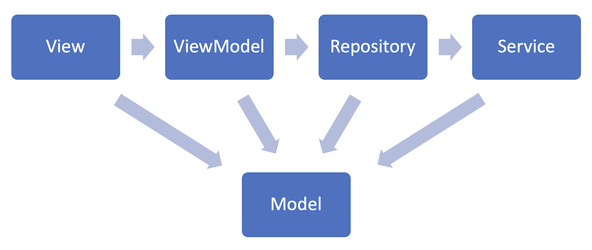

## MVVM Katmanları

* [Model](#model)
* [View](#view)
* [ViewModel](#viewmodel)

### Model

Model katmanı, projemizde kullanacağımız model sınıflarını tanımlayacağımız katmandır.

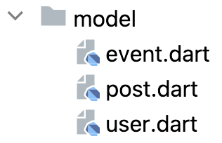

 **Model katmanı projemizin temelidir ve kesinlikle tüm katmanlardan bağımsız olmalıdır.** Örnek vermek gerekirse:

*user.dart*

```dart
class User {
  dynamic userId;
  String email;
  DateTime birthDate;

  User(this.userId, this.email, this.birthDate);
}
```

Yukarıda bir User (Kullanıcı) model sınıfı tanımladık. Burada "birthDate" isminde bir özellik görüyoruz. Bu özellik, kullanıcının doğum tarihi bilgisini tutacaktır.

Projemizde veri tabanı servisi olarak *Firebase Firestore* kullanmak istediğimizi varsayalım. *Firestore*'un tarih bilgisi için kendine özgü, "Timestamp" isminde bir veri yapısı vardır. Bu durumda tarih bilgisini veri tabanında *DateTime* olarak değil *Timestamp* olarak tutacağız. Bu sebeple model sınıfını aşağıdaki gibi düzenlemek akla gelebilir.

*user.dart*

```dart
import 'package:cloud_firestore/cloud_firestore.dart';

class User {
  dynamic userId;
  String email;
  Timestamp createdDate;

  User(this.userId, this.email, this.createdDate);
}
```

**Ancak bu tamamen yanlış bir kullanımdır.** Burada model sınıfımızı kullanılan servise (Firestore) bağımlı hale getiriyoruz. İleride Firestore yerine başka bir servis kullanmak istediğimizde model sınıfında da değişiklik yapmamız gerekecektir. Ancak, **diğer katmanlarda yapılan değişiklikler model sınıfını hiçbir şekilde etkilememelidir.**

Doğru kullanım ilk kod parçasındaki gibi, tarih bilgisini *DateTime* türünde tutmaktır. Çünkü *DateTime* türü temel Dart paketlerine ait bir türdür ve projemiz için evrenseldir. Her servisin kendisine ait türler tabii ki olacaktır. Örneğin Firestore kullandığımız durumda tarih bilgisini tabii ki *Timestamp* türünde depolayacağız. Ancak bu dönüşümü **model sınıfında değil, ilgili servise ait servis sınıfında yapacağız.**

> ***!!!*** Model katmanı diğer tüm katmanlarıdan bağımsızdır. Model katmanından diğer hiçbir katmana erişilmemelidir.

> ***!!!*** Model katmanı projenin temelidir. Diğer tüm katmanlar model katmanına erişebilir.

> ***NOT:*** *userId* değişkenini *dynamic* olarak tanımlamamızın sebebi de model sınıfını servisten bağımsız yapmaktır. Çünkü Firestore, MongoDB gibi NoSQL tabanlı veri tabanlarında *id* bilgisi *String* türündeyken, SQLite, MySQL gibi SQL tabanlı veri tabanlarında *id* bilgisi *int* türündedir. Bu yüzden diğer özelliklerin aksine *id* bilgisini *dynamic* yaparak hem servisten bağımsız hale getiriyoruz hem de aynı anda birden fazla veri tabanı servisi kullanma ihtimaline hazır hale getirmiş oluyoruz.

---

### View

View katmanı, görsel arayüzü tanımlayan kodları içeren katmandır.

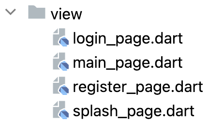

 **View katmanı sadece görsel arayüzü tanımlayan kodları içermelidir, mantıksal işlemler View katmanında yer almamalıdır.** Mantıksal işlemler, bir sonraki katman olan *ViewModel* katmanında tutulmalıdır. Örneğin, aşağıda basit bir giriş (login) ekranına ait kodlar yer almaktadır.

```dart
import 'package:flutter/material.dart';

class LoginPage extends StatelessWidget {
  final TextEditingController _emailController = TextEditingController();
  final TextEditingController _passwordController = TextEditingController();

  LoginPage({super.key});

  @override
  Widget build(BuildContext context) {
    return Scaffold(
      body: _buildBody(context),
    );
  }

  Widget _buildBody(BuildContext context) {
    return Column(
      children: [
        _buildEmailTextField(),
        _buildPasswordTextField(),
        _buildLoginButton(),
      ],
    );
  }

  Widget _buildEmailTextField() {
    return TextField(controller: _emailController);
  }

  Widget _buildPasswordTextField() {
    return TextField(controller: _passwordController);
  }

  Widget _buildLoginButton() {
    return ElevatedButton(
      child: Text("Login"),
      onPressed: () {
        viewModel.signInWithEmailAndPassword(
          _emailController.text.trim(),
          _passwordController.text.trim(),
        );
      },
    );
  }
}
```

Buradaki tüm kodlar görsel arayüzü tanımlamaktadır. Mantıksal kodlar ise *ViewModel* katmanında yer almaktadır. Örneğin, "Login" butonuna tıklandığında "signInWithEmailAndPassword" isminde bir fonksiyon çağrılmıştır. Bu fonksiyon bu sınıfta (LoginPage) oluşturulmamış, onun yerine ViewModel sınıfında oluşturulmuş ve *viewModel* nesnesi aracılığıyla ViewModel katmanına ulaşarak bu fonksiyonun çağrılması hedeflenmiştir. Ancak tabii şu anda *viewModel* nesnesi henüz oluşturulmadığı için kod hata verecektir. View katmanından ViewModel katmanına nasıl ulaşılacağına *State Management* başlığı altında değinilecektir.

> ***!!!*** View katmanından sadece Model ve ViewModel katmanlarına erişilmelidir. Service, Repository, vb. gibi, diğer hiçbir katmana erişilmemelidir.

> ***!!!*** Diğer hiçbir katman View katmanına erişmemelidir.

---

### ViewModel

**MVVM mimarisinin kuralları gereği, her View sınıfına karşılık gelen bir ViewModel sınıfı mutlaka oluşturulmalıdır.**

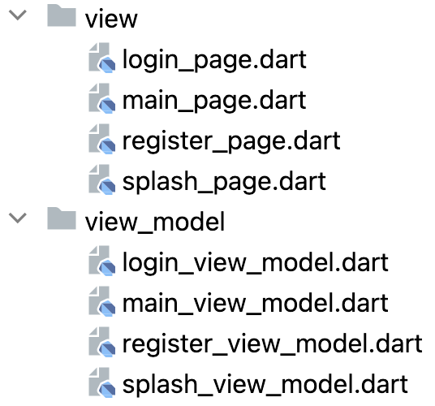

ViewModel katmanı, ait olduğa View'a dair mantıksal kodları tutar. Örneğin:

```dart
import 'package:flutter/material.dart';
import 'package:test_app/model/user.dart';

enum LoginViewState { idle, loading }

class LoginViewModel with ChangeNotifier {
  LoginViewState _state = LoginViewState.idle;

  void signInWithEmailAndPassword(String email, String password) async {
    if (_state == LoginViewState.idle) {
      _state = LoginViewState.loading;
      try {
        dynamic userId = await _authRepository.signInWithEmailAndPassword(
          email,
          password,
        );
        if (userId != null) {
          User user = User(userId, email, DateTime.now());
          await _userDatabaseRepository.addUser(user);
        }
        _state = LoginViewState.idle;
      } catch (e) {
        _state = LoginViewState.idle;
      }
    }
  }
}
```

Görüldüğü gibi *signInWithPhoneNumber* fonksiyonunda oldukça uzun bir işlem yapıyoruz. Önce authentication servisine ulaşarak kimlik doğrulama işlemi yapıyoruz. İşlem başarılıysa dönen *id* ile bir *User* nesnesi oluşturuyoruz ve bu kez veri tabanı servisine ulaşıp kullanıcıyı veri tabanına ekliyoruz. Bununla birlikte *state (durum)* yönetimini de geçekleştiriyoruz.

Fonksiyonda yaptığımız işlemlerin tamamı mantıksal (logical) işlemler ve ara yüzü tanımlamakla hiçbir ilgisi bulunmuyor. Bu yüzden *signInWithPhoneNumber* fonksiyonunu *LoginPage* sınıfında değil, *LoginViewModel* sınıfında tanımlamak doğru yaklaşımdır.

Fonksiyonda ***_authRepository*** ve ***_userDatabaseRepository*** şeklinde iki değişken görüyoruz. Bu değişkenleri oluşturmadan kullandığımız için fonksiyon hata verecektir. Bu değişkenleri nerede tanımlayacağımızı **Veri Katmanları** konusundan sonra inceleyeceğiz ancak burada önemli nokta şudur: **ViewModel katmanından doğrudan Service katmanına değil, Repository katmanına ulaşıyoruz.** Bunun sebebini *Repository* başlığı altında ayrıntılı inceleyeceğiz.

> ***!!!*** ViewModel katmanından sadece Model ve Repository katmanlarına erişilmelidir. View, Service, vb. gibi, diğer hiçbir katmana erişilmemelidir.

> ***!!!*** ViewModel katmanına erişen tek katman View katmanı olmalıdır. Diğer hiçbir katman ViewModel katmanına erişmemelidir.

## State Management (Provider)

Projemizde durum yönetimi sistemi olarak **Provider** kullanıyoruz. Provider'ın seçilme sebebi, hem durum yönetimi sistemleri arasındaki ayrım ilk çıktığında Flutter ekibinin Provider'ı önermesi, hem Flutter ekibinin kod örneklerinde hala Provider'ı kullanması hem de Provider'ın tüm ihtiyaçlarımızı karşılayan etkili bir durum yönetimi sistemi olmasıdır.

Daha önce Bloc, GetX ve benzeri durum yönetimi sistemleri kullanmış olabilirsiniz ve bu durum yönetimi sistemlerinin de oldukça etkili olduğunu düşünüyor olabilirsiniz. Her durum yönetimi sisteminin tabii ki kendince avantajları vardır ve birçok projede kullandıysanız, favori durum yönetim sisteminiz size daha *iyi* geliyor olabilir. **Ancak biz projelerimizde Provider durum yönetim sistemini kullanarak devam edeceğiz ve tüm mimarimizi de buna uygun olarak kuracağız.**

* [ChangeNotifierProvider](#changenotifierprovider)
* [Provider.of](#providerof)
* [Consumer](#consumer)

---

### ChangeNotifierProvider

View'dan ViewModel'a ulaşmak için, öncelikle ViewModel'ı View'a enjekte etmeliyiz. Bu işlemi de her zaman sayfayı oluşturduğumuz yerde yapacağız. Sayfaları hiçbir zaman doğrudan çağırmayacağız, çağırdığımız yerde her zaman ViewModel'ı da Provider olarak enjekte edeceğiz:

* Yanlış kullanım:

```dart
class MyApp extends StatelessWidget {
  const MyApp({super.key});

  @override
  Widget build(BuildContext context) {
    return MaterialApp(
      home: LoginPage(),
    );
  }
}
```

* Doğru kullanım:

```dart
class MyApp extends StatelessWidget {
  const MyApp({super.key});

  @override
  Widget build(BuildContext context) {
    return MaterialApp(
      home: ChangeNotifierProvider(
        create: (context) => LoginViewModel(),
        child: LoginPage(),
      ),
    );
  }
}
```

* Yanlış kullanım:

```dart
void openRegisterPage(BuildContext context) {
  Navigator.pushReplacement(
    context,
    MaterialPageRoute(
      builder: (context) => RegisterPage(),
    ),
  );
}
```

* Doğru kullanım:

```dart
void openRegisterPage(BuildContext context) {
  Navigator.pushReplacement(
    context,
    MaterialPageRoute(
      builder: (context) => ChangeNotifierProvider(
        create: (context) => RegisterViewModel(),
        child: RegisterPage(),
      ),
    ),
  );
}
```

---

View'dan ViewModel'a ulaşırken ise aşağıdaki iki yapıdan birini kullanacağız:

1. [Provider.of - listen: false](#providerof)
2. [Consumer](#consumer)

### Provider.of

Eğer amacımız sadece ViewModel'daki bir fonksiyona, değişkene, vs. ulaşmaksa, **View'daki mevcut öğenin ekrandaki durumu güncellenmeyecekse**, *Provider.of* yapısını kullanıyoruz. *View* başlığı altında gördüğümüz, butonu oluşturan fonksiyonu aşağıdaki gibi güncellemek doğru olacaktır.

```dart
Widget _buildLoginButton(BuildContext context) {
  LoginViewModel viewModel = Provider.of(
    context,
    listen: false,
  );
  return ElevatedButton(
    child: Text("Login"),
    onPressed: () {
      viewModel.signInWithEmailAndPassword(
        _emailController.text.trim(),
        _passwordController.text.trim(),
      );
    },
  );
}
```

Böylece *viewModel* nesnesini nasıl oluşturacağımızı öğrenerek fonksiyondaki hatayı da çözmüş oluyoruz. Burada *Consumer* yerine *Provider.of* yapısını kullanmamızın sebebi butonun ekrandaki görüntüsünün değişmeyecek olmasıdır. Yani butonun işlevi ViewModel'daki gerekli fonksiyonu çağırmaktır. **Buton herhangi bir değişiklikten etkilenmeyecek, durumu güncellenmeyecektir.** Bu tarz durumlar için Provider.of yapısını kullanıyoruz.

> ***!!!*** Provider.of yapısını her zaman burada olduğu gibi, ***listen*** isimlendirilmiş parametresine ***false*** değerini atayarak kullanacağız. Yani,
> * Doğru kullanım: Provider.of(context, listen: false);
> * Yanlış kullanım: Provider.of(context);

---

### Consumer

Eğer ViewModel'a ulaştığımız widget'ın durumunda güncelleme olacaksa Consumer yapısını kullanıyoruz. Örneğin bir Checkbox düşünelim.

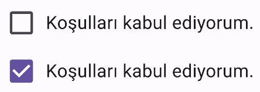

Yukarıda görüldüğü gibi, Checkbox'a her tıklandığında Checkbox'ın görüntüsü değişecek, seçili olduğu durumda (state) farklı, seçili olmadığı durumda farklı bir görüntüye sahip olacaktır. Yani durumu (state) güncellenecektir. Bu durumda yapılması gereken işlemler şu şekildedir:

1. Checkbox'ın durum bilgisini tutacak değişkeni ViewModel'da (**View'da değil)** private olarak oluşturmak, ardından bu değişkene ait getter ve setter oluşturmak, setter içerisinde ***notifyListeners*** fonksiyonunu çağırmak:

```dart
class LoginViewModel with ChangeNotifier {
  LoginViewState _state = LoginViewState.idle;

  bool _termsAccepted = false;

  bool get termsAccepted => _termsAccepted;

  set termsAccepted(bool value) {
    _termsAccepted = value;
    notifyListeners();
  }

  ...
}
```

***notifyListeners*** fonksiyonu, bu sınıfı (LoginViewModel) dinleyen sınıflarda (LoginPage) *Consumer* ile sarmalanmış tüm widget'ların durumunun güncellenmesini sağlar. Bizim örneğimizde bu widget, Checkbox widget'ıdır.

> ***NOT:*** ***notifyListeners*** fonksiyonu *ChangeNotifier* sınıfına ait bir fonksiyondur. Bu yüzden tüm ViewModel'larımıza "**with ChangeNotifier**" yapısını kullanarak *ChangeNotifier* sınıfını dahil ediyoruz.

2. Durumu güncellenecek widget'ı Consumer ile sarmalamak:

```dart
Consumer<LoginViewModel>(
  builder: (context, viewModel, child) => Checkbox(
    value: viewModel.termsAccepted,
    onChanged: (bool? newValue) {
      if (newValue != null) {
        viewModel.termsAccepted = newValue;
      }
    },
  ),
),
```

*onChanged* parametresine atanan fonksiyonda ViewModel'daki _termsAccepted değişkeninin setter'ına ulaşmış oluyoruz ve değişkenin değerini değiştiriyoruz. setter içerisinde *notifyListeners* fonksiyonu çağrıldığı için, View'da Consumer ile sarmalanmış olan widget'lar güncelleniyor. Checkbox'ı Consumer'la sarmaladığımız için de Checkbox güncellenip, *value* parametresinde kullandığımız *termsAccepted* değişkeninin güncel değeriyle birlikte ekrana tekrar çiziliyor. Ancak *setState* kullanmanın aksine tüm ekran yeniden çizilmiyor, Consumer ile sarmalanan tek widget Checkbox olduğu için sadece Checkbox yeniden çiziliyor.

> ***ÖZET:*** Eğer ViewModel'a ulaşmamızı sağlayan widget'ın durumu güncellenecekse **Consumer** ile sarmalıyoruz. Widget'ın durumu güncellenmeyecekse, tek hedefi ViewModel'a ulaşmaksa **Provider.of - listen: false** yapısını kullanıyoruz.

## Veri Katmanları

Servis bağlantısı kuracağımız katmanlardır. Bu servisler projeden projeye değişiklik gösterebilmekle birlikte genellikle projelerimizde aşağıdaki gibi servislerimiz olur.

* Kimlik Doğrulama Servisi (Authentication Service) 
* Veri Tabanı Servisi (Database Service)
  * User Database Service
  * Post Database Service
  * Event Database Service
  * ...
* Dosya Depolama Servisi (Storage Service)
* Bildirim Servisi (Notification Service)
* ...

Görüldüğü gibi her servis türünü ayrı ayrı ele alacağız. Buradaki amaç hem kod okunabilirliğini arttırmak hem de bağımlılığı ortadan kaldırarak farklı işlemler için farklı servisler kullanabilme olanağı yaratmaktır. Örneğin, pratiklik sağladığından kimlik doğrulama (authentication) işlemleri için Firebase Authentication kullandığımızı varsayalım. Ancak veri tabanı işlemleri için Firebase kullanmak istemediğimizi, örneğin SQL tabanlı bir veri tabanı servisi kullanmak istediğimizi düşünelim. Kimlik Doğrulama ve Veri Tabanı katmanlarını birbirinden ayırdığımız için bunu rahatlıkla yapabiliriz. Eğer farklı servisler için farklı katmanlar kullanmasaydık, bir serviste Firebase kullandığımızda tüm servisler için Firebase teknolojisini kullanmamız gerekirdi. Ancak hiçbir projede bu zorunluluğu istemiyoruz. Burada önemli bir not düşelim: **Projenin başlangıcında her servis için aynı teknolojiyi (örneğin Firebase) kullanmayı kararlaştırsak dahi katmanları birbirinden ayıracağız. Çünkü ileride bu tercih değişebilir. Kodumuz her türlü değişikliğe olabildiğince hızlı ve kolay adapte olmalıdır.**

Yukarıdaki listede veri tabanı servislerini de kendi içinde alt katmanlara ayırdığımızı görüyoruz (User Database Service, Post Database Service, ...). Bunun asıl sebebi kod okunabilirliğini arttırmaktır. Proje ilerledikçe veri tabanı servisindeki fonksiyonlar diğer servislere kıyasla çok daha fazla arttığından, bu servislere ait kodları farklı dosyalarda toplamak kod okunabilirliğini arttırmaktadır. Dökümanın devamında bu durumla ilgili dosya yapısına ait örnekler ve kod örnekleri yer almaktadır.

Veri katmanları aşağıdaki gibidir:

* [Base](#base)
* [Service - Base](#service---base)
* [Service](#service)
* [Repository](#repository)
* [GetIt (locator)](#getit-locator)

---

### Base

Bu katman, belli bir servis türü için tüm katmanlarda (Repository ve servisler) kullanacağımız ortak fonksiyon yapılarını tanımlayacağımız arayüzleri (interface) içerir. Dart dilinde *interface* kavramı olmadığından *soyut sınıf (abstract class)* kullanıyoruz.

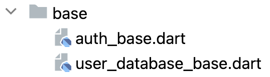

*auth_base.dart*

```dart
abstract class AuthBase {
  Future<dynamic> getUserId();
  Future<dynamic> signInWithEmailAndPassword(
    String email,
    String password,
  );
  Future<dynamic> registerWithEmailAndPassword(
    String email,
    String password,
  );
  Future<dynamic> signInWithGoogle();
  Future<dynamic> signInWithApple();
  Future<void> resetPassword(String email);
  Future<void> logout();
}
```

*user_database_base.dart*

```dart
abstract class UserDatabaseBase {
  Future<void> addUser(User user);
  Future<User?> getUser(userId);
  Future<bool> updateUser(userId, Map<String, dynamic> newValues);
}
```

---

### Service - Base

Servis katmanı altında, **base** isimli bir klasör yer alıyor.


Bu klasörde, Base katmanında tanımladığımız dosyalar için, servislerin temel alacağı arayüzler (interface) üreteceğiz.

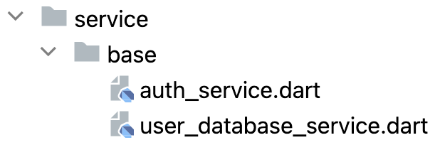

Dosyaların içeriği aşağıdaki gibi olacaktır.

*auth_service.dart*

```dart
import 'package:test_app/base/auth_base.dart';

abstract class AuthService implements AuthBase {}
```

*user_database_service.dart*

```dart
import 'package:test_app/base/user_database_base.dart';

abstract class UserDatabaseService implements UserDatabaseBase {}
```

Bu dosyalarda ileride değişiklik yapılmayacaktır. Eğer ekstra bir durum olur ve *Service* katmanında bulunması gereken ancak ***Repository* katmanında bulunmaması gereken** bir fonksiyon olursa bu arayüzde tanımlanabilir. Ancak buna çok nadir bir durum olmazsa ihtiyaç duymayacağız. Genellikle fonksiyonlarımızın her iki katmanda da (Service ve Repository) bulunması gerekir. Bu fonksiyonların yapısını da *Service - Base* katmanında değil, daha önce değindiğimiz temel *Base* katmanında tanımlayacağız.

---

### Service

Projemizde kullanacağımız her bir servis için, o servise dair kodların yer alacağı birer klasör (paket) oluşturacağız.

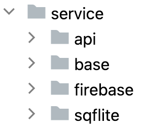

Firebase servisini kullanıyorsak, yukarıdaki gibi *"firebase"* isimli bir klasör oluşturacağız ve Firebase'e dair tüm kodları bu klasör altında toplayacağız. Aynı şekilde bir API aracılığıyla veri okuyup yazıyorsak, bu API'ye bağlanmak için gerekli tüm işlemleri *"api"* klasörü altında toplayacağız. Yerel veri tabanı olarak da SQFLite kullandığımızı düşünelim. SQFLite'a dair tüm kodları da *"sqflite"* klasörü altında bulunduracağız.

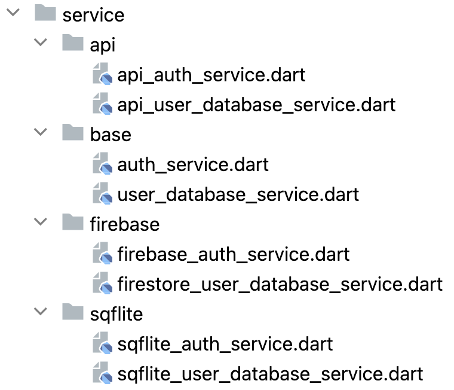

Örnek dosya içerikleri de aşağıdaki gibi olacaktır.


*firebase_auth_service.dart*

```dart
import 'package:test_app/service/base/auth_service.dart';

class FirebaseAuthService implements AuthService {
  @override
  Future getUserId() {}

  @override
  Future signInWithEmailAndPassword(String email, String password) {}

  @override
  Future registerWithEmailAndPassword(String email, String password) {}

  @override
  Future signInWithGoogle() {}

  @override
  Future signInWithApple() {}

  @override
  Future<void> resetPassword(String email) {}

  @override
  Future<void> logout() {}
}

```

*firestore_user_database_service.dart*

```dart
import 'package:test_app/model/user.dart';
import 'package:test_app/service/base/user_database_service.dart';

class FirestoreUserDatabaseService implements UserDatabaseService {
  @override
  Future<void> addUser(User user) {}

  @override
  Future<User?> getUser(userId) {}

  @override
  Future<bool> updateUser(userId, Map<String, dynamic> newValues) {}
}
```

*sqflite_user_database_service.dart*

```dart
import 'package:test_app/model/user.dart';
import 'package:test_app/service/base/user_database_service.dart';

class SqfliteUserDatabaseService implements UserDatabaseService {
  @override
  Future<void> addUser(User user) {}

  @override
  Future<User?> getUser(userId) {}

  @override
  Future<bool> updateUser(userId, Map<String, dynamic> newValues) {}
}
```

Oluşturulan servis için, Service - Base katmanındaki ilgili arayüz sınıfa uygulandığında (implements - örneğin **FirestoreUserDatabaseService** sınıfına **UserDatabaseService** sınıfını uygulamak gibi), IDE bizi gerekli fonksiyonları *override* etmemiz noktasında uyaracak ve yine IDE bu fonksiyonları otomatik oluşturmak için seçenek sunacaktır. O servis sınıfı üzerinde çalışan yazılımcının buradaki görevi, oluşan fonksiyonların gövdesini doldurmaktır.

> ***!!!*** Fonksiyonlar otomatik olarak *override* edildiğinde *Base* katmanında tanımlandıkları sırayla değil, alfabetik sırayla oluşmaktadır. Biz düzenlilik ve kod okunabilirliği açısından, fonksiyonları **mutlaka** yukarıdaki örneklerde olduğu gibi *Base* katmanında tanımlı oldukları sıraya alıyoruz.

> ***!!!*** Her servise ait kodlar, **mutlaka** sadece ilgili dosya altında toplanmalıdır. Örneğin, kapsamlı bir projemiz olduğunu ve tüm projede Firebase kullandığımızı varsayalım. İleride projeden Firebase kütüphanesini kaldırdığımızda, **kesinlikle hata aldığımız tek klasör *"firebase"* klasörü olmalıdır. Çünkü Firebase kodu bulunan, bu kütüphaneye bağımlı olan tek klasör *"firebase"* klasörü olmalıdır.** Örneğin, sadece *firestore* kütüphanesini projemizden kaldırırsak aşağıdaki görüntüyle karşılaşmalıyız.

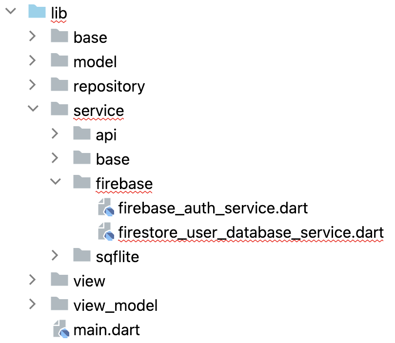

> ***!!!*** Sadece *"firestore_user_database_service.dart"* dosyasında hata oluştuğunu görüyoruz. Başka hiçbir klasördeki hiçbir dosyada hata olmamalıdır. Çünkü Firestore servisi dışındaki hiçbir dosyada **asla** Firestore kodu bulunmamalıdır. Öyle ki, *"firebase_auth_service.dart"* dosyası *"Firestore"* kütüphanesine değil *"Firebase Auth"* kütüphanesine bağımlı olduğu için, *"firebase"* klasöründe yer almasına rağmen bu dosyada bile herhangi bir hata oluşmamalıdır.

> ***!!!*** Service katmanından sadece Model katmanına erişilmelidir. View, ViewModel, Repository, vb. gibi, diğer hiçbir katmana erişilmemelidir.

> ***!!!*** Service katmanına erişen tek katman Repository katmanı olmalıdır. Diğer hiçbir katman Service katmanına erişmemelidir.

---

### Repository

Repository katmanı, *ViewModel* katmanı ile *Service* katmanı arasında kullanılacak olan ara katmandır. Her bir servis türü için *Repository* katmanında da birer sınıf tanımlanmalı ve bu sınıfa *Base* katmanındaki ilgili arayüz uygulanarak (implements), *Base* katmanında tanımlı tüm fonksiyonlar otomatik olarak *override* edilmelidir.


*auth_repository.dart*

```dart
import 'package:test_app/base/auth_base.dart';
import 'package:test_app/service/base/auth_service.dart';
import 'package:test_app/service/firebase/firebase_auth_service.dart';

class AuthRepository implements AuthBase {
  final AuthService _service = locator<FirebaseAuthService>();

  @override
  Future getUserId() async {
    return await _service.getUserId();
  }

  @override
  Future signInWithEmailAndPassword(String email, String password) async {
    return await _service.signInWithEmailAndPassword(email, password);
  }

  @override
  Future registerWithEmailAndPassword(String email, String password) async {
    return await _service.registerWithEmailAndPassword(email, password);
  }

  @override
  Future signInWithGoogle() async {
    return await _service.signInWithGoogle();
  }

  @override
  Future signInWithApple() async {
    return await _service.signInWithApple();
  }

  @override
  Future<void> resetPassword(String email) async {
    return await _service.resetPassword(email);
  }

  @override
  Future<void> logout() async {
    return await _service.logout();
  }
}
```

*user_database_repository.dart*

```dart
import 'package:test_app/base/user_database_base.dart';
import 'package:test_app/model/user.dart';
import 'package:test_app/service/base/user_database_service.dart';
import 'package:test_app/service/firebase/firestore_user_database_service.dart';

class UserDatabaseRepository implements UserDatabaseBase {
  final UserDatabaseService _service = locator<FirestoreUserDatabaseService>();

  @override
  Future<void> addUser(User user) async {
    return await _service.addUser(user);
  }

  @override
  Future<User?> getUser(userId) async {
    return await _service.getUser(userId);
  }

  @override
  Future<bool> updateUser(userId, Map<String, dynamic> newValues) async {
    return await _service.updateUser(userId, newValues);
  }
}
```

Görülebileceği gibi, *Repository* katmanının tek işlevi, aktif olarak kullanılan servisten aynı fonksiyonu çağırmaktır. Bunun dışında *Repository* katmanıyla işimiz bulunmamaktadır. Daha önce *ViewModel* başlığı altında da gördüğümüz gibi, ViewModel'dan aktif olan servise değil, *Repository* katmanına ulaşıyoruz, *Repository* katmanı *Service* katmanına ulaşıyor. Yani ViewModel'dan servise doğrudan değil, *Repository*'yi aracı vazifesinde kullanarak ulaşıyoruz. Bunun iki çok önemli avantajı vardır:

1. Kullandığımız servisi tüm projede değiştirmek istersek, *Repository* sınıfında bulunan, tek satırdaki tek bir kelimeyi değiştirmemiz yeterli olacaktır.

*user_database_repository.dart*

```dart
class UserDatabaseRepository implements UserDatabaseBase {
  final UserDatabaseService _service = locator<FirestoreUserDatabaseService>();

  ...
}
```

Burada *"FirestoreUserDatabaseService"* ifadesini görüyoruz. Veri tabanı olarak Firestore kullanmak yerine, her yerde yerel veri tabanı, yani SQFLite kullanmaya karar verdiğimizi düşünelim. Aşağıdaki değişiklik yeterli olacaktır.

*user_database_repository.dart*

```dart
class UserDatabaseRepository implements UserDatabaseBase {
  final UserDatabaseService _service = locator<SqfliteUserDatabaseService>();

  ...
}
```

Projemizde kaç sayfa olursa olsun başka işlem yapmamıza gerek yoktur. Eğer *Firestore* servisine *ViewModel* sınıflarından doğrudan ulaşmış olsaydık tüm *ViewModel* sınıflarında tek tek değişiklik yapmamız gerekirdi. *Repository* katmanını aracı olarak kullanarak bu sorunun önüne geçmiş oluyoruz.

2. İstediğimiz işlem için aynı anda birden fazla servisi rahatlıkla kullanabiliriz. Örneğin, kullanıcıları hem Firestore servisine hem de garanti olması açısından yerel veri tabanı servisine kaydetmek istediğimizi düşünelim. Sadece *Repository* sınıfında, aşağıdaki değişikliği yapmamız yeterli olacaktır.

*user_database_repository.dart*

```dart
class UserDatabaseRepository implements UserDatabaseBase {
  final UserDatabaseService _service = locator<FirestoreUserDatabaseService>();
  final UserDatabaseService _localService = locator<SqfliteUserDatabaseService>();

  @override
  Future<void> addUser(User user) async {
    await _localService.addUser(user);
    return await _service.addUser(user);
  }

  ...
}
```

---

### GetIt (locator)

Repository sınıfında aşağıdaki gibi bir ifade görüyoruz.

*user_database_repository.dart*

```dart
final UserDatabaseService _service = locator<FirestoreUserDatabaseService>();
```

Buradaki ***locator*** ifadesi, ilgili sınıfı **Singleton** olarak kullanmamızı sağlamaktadır. Projemizdeki tüm *Repository* ve *Service*'leri Singleton olarak aşağıdaki dosyaya kaydedeceğiz.


*locator.dart*

```dart
import 'package:get_it/get_it.dart';
import 'package:test_app/repository/auth_repository.dart';
import 'package:test_app/repository/user_database_repository.dart';
import 'package:test_app/service/api/api_auth_service.dart';
import 'package:test_app/service/api/api_user_database_service.dart';
import 'package:test_app/service/firebase/firebase_auth_service.dart';
import 'package:test_app/service/firebase/firestore_user_database_service.dart';
import 'package:test_app/service/sqflite/sqflite_auth_service.dart';
import 'package:test_app/service/sqflite/sqflite_user_database_service.dart';

GetIt locator = GetIt.instance;

setupLocator() {
  locator.registerLazySingleton(() => AuthRepository());
  locator.registerLazySingleton(() => FirebaseAuthService());
  locator.registerLazySingleton(() => ApiAuthService());
  locator.registerLazySingleton(() => SqfliteAuthService());

  locator.registerLazySingleton(() => UserDatabaseRepository());
  locator.registerLazySingleton(() => FirestoreUserDatabaseService());
  locator.registerLazySingleton(() => ApiUserDatabaseService());
  locator.registerLazySingleton(() => SqfliteUserDatabaseService());
}
```

ViewModel'dan Repository sınıfına ulaşmak için de aşağıdaki gibi *Singleton* olarak oluşturulan nesneyi kullanacağız.

```dart
class LoginViewModel with ChangeNotifier {
  final AuthRepository _authRepository = locator<AuthRepository>();
  final UserDatabaseRepository _userDatabaseRepository = locator<UserDatabaseRepository>();

  ...
}
```

Böylece projedeki her bir katmanın (MVVM Katmanları ve Veri Katmanları) mantığını ve kullanımını öğrenmiş olduk.